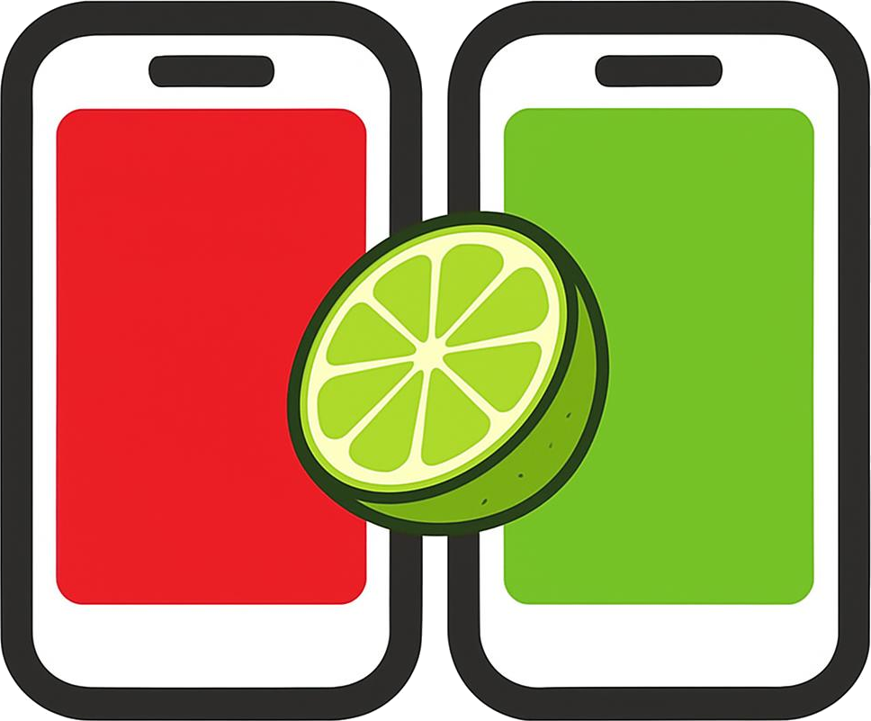

<h1 align="center">
  
  <br />
  Taqwright
</h1>

<p align="center">
  <a href="https://github.com/taqelah/taqwright/tags"></a>
  <a href="https://www.npmjs.com/package/@taqwright/taqwright"></a>
  <a href="LICENSE"></a>
  <a href="https://www.typescriptlang.org/"></a>
</p>

E2E mobile UI testing on the Playwright runner, with a flat locator API on top of Appium 3.

```ts
import { test, expect } from '@taqwright/taqwright';

test('User can login', async ({ mobile }) => {
  await mobile.getByLabel('Username').fill('admin');
  await mobile.getByLabel('Password').fill('password');
  await mobile.getByText('Login').click();
  await expect(mobile.getByText('Welcome')).toBeVisible();
});
```

> 📚 **Full documentation: [taqwright.dev/docs](https://www.taqwright.dev/docs/category/getting-started)** — install taqwright, write and generate tests, run and debug them, and scale out in parallel.

<p align="center">
  <a href="https://www.youtube.com/watch?v=FBxFg1XbuKE">
    
  </a>
</p>
<p align="center"><a href="https://www.youtube.com/watch?v=FBxFg1XbuKE">▶ Watch the codegen demo</a></p>

<p align="center">
  <a href="https://www.youtube.com/watch?v=pk7wky1KHX8">
    
  </a>
</p>
<p align="center"><a href="https://www.youtube.com/watch?v=pk7wky1KHX8">▶ Taqwright in 3 minutes: install, scaffold, and run your first Android test</a></p>

## Why Taqwright?

If you've used Playwright, you already know Taqwright.

|                            | Taqwright                                                                            | Mobilewright                                                                                                         |
| -------------------------- | ------------------------------------------------------------------------------------ | -------------------------------------------------------------------------------------------------------------------- |
| **Codegen tool**           | Yes (built-in `codegen`)                                                             | No                                                                                                                   |
| **React Native & Flutter** | Yes                                                                                  | No                                                                                                                   |
| **AI / agents**            | AI test generation — [Taqwright Lime CLI](https://www.taqwright.ai/), Appium MCP     | Depends on accessibility ids — no xpath/platform fallback, so legacy apps without accessibility metadata are limited |
| **Locators**               | Roles / labels + id / xpath / UiAutomator / predicate / class-chain                  | Roles / labels                                                                                                       |
| **Real devices (cloud)**   | BrowserStack, LambdaTest — and support for all your favourite cloud device platforms | Vendor-locked to mobile-use.com                                                                                      |
| **Automation engine**      | Appium 3 / WebDriver                                                                 | mobilecli (custom)                                                                                                   |
| **API style**              | Playwright (`getByRole`, `expect`)                                                   | Playwright (`getByRole`, `expect`)                                                                                   |
| **Auto-wait**              | Built-in, every action                                                               | Built-in, every action                                                                                               |
| **Cross-platform**         | iOS + Android, one API                                                               | iOS + Android, one API                                                                                               |
| **Test runner**            | Playwright Test fixtures                                                             | Playwright Test fixtures                                                                                             |

## Features

- **Playwright-style API** — `mobile.getByRole('button').click()`, just like `page.getByRole('button').click()`
- **Cross-platform** — one API for iOS and Android
- **Native, React Native & Flutter** — drive any app
- **Auto-waiting** — actions wait for elements to be visible, enabled, and stable before interacting
- **Retry assertions** — `expect(locator).toBeVisible()` polls until satisfied or times out
- **Rich locators** — `getByRole` / `getByText` / `getByLabel`, plus `xpath` / UiAutomator / NSPredicate / class-chain
- **Built-in codegen** — `npx taqwright codegen` records a test as you tap through the app
- **Cloud devices in ~10 seconds** — point a project at BrowserStack or LambdaTest with a few lines of config
- **Auto-discover devices** — `device.autoDiscover` finds and assigns emulators/simulators to each worker
- **Parallel testing, handled** — taqwright spawns and manages a dedicated Appium session per worker automatically
- **Traces, video & reports** — per-action traces, full-run videos, and Playwright reporters
- **Test fixtures** — `@taqwright/taqwright` adds a `mobile` fixture to Playwright Test

## Requirements

- Node.js **24.x or newer**.
- A booted Android emulator, iOS simulator, or connected device.
- [Appium 3.x](https://appium.io) (`npm i -g appium@^3`) running on `localhost:4723`, with the relevant driver installed:
  - Android: `appium driver install uiautomator2`
  - iOS: `appium driver install xcuitest`
- Platform tools on `PATH`: `adb` (Android), `xcrun` (iOS, macOS only), `java` (UiAutomator2).

## Install

taqwright is published on npm:

```bash
npm install --save-dev @taqwright/taqwright
```

In `package.json` it looks like:

```json
"devDependencies": {
  "@taqwright/taqwright": "^0.0.25"
}
```

The package imports as `@taqwright/taqwright` and the CLI command is `taqwright`.

## Quick start

```bash
npx taqwright init               # interactive scaffolder — creates package.json, tsconfig, sample test
npx taqwright doctor             # verify your env (adb, xcrun, java, appium)
npx taqwright devices            # list local emulators / simulators
npx taqwright codegen            # record a test as you tap through the app (Playwright-codegen-style)
npx taqwright test               # run your tests
```

## Start from the sample project

Prefer a ready-made project? Clone the demo, install, and run it to see a passing suite right away.

[**Taqwright/taqwright-demo**](https://github.com/Taqwright/taqwright-demo) is a full taqwright suite for the bundled **DemoApp** (a Flutter app). It runs on local emulators / simulators or on real devices in the cloud via BrowserStack, and the app binaries (`.apk` / `.app`) ship in the repo so it works out of the box.

```bash
git clone https://github.com/Taqwright/taqwright-demo
cd taqwright-demo
npm install
npm test            # run the default suite
```

### Parallel testing demo

The local Android suite ships four run modes, each its own project:

| Script                | Project          | Mode                                              | Workers |
| --------------------- | ---------------- | ------------------------------------------------- | ------- |
| `npm run test:single` | `android-single` | one emulator, pinned udid (`emulator-5554`)       | 1       |
| `npm run test:pool`   | `android-pool-2` | hand-written 2-emulator udid pool (`5554`+`5556`) | 2       |
| `npm run test:auto1`  | `android-auto-1` | auto-detect host AVDs                             | 1       |
| `npm run test:auto2`  | `android-auto-2` | auto-detect host AVDs                             | 2       |

`npm run test:auto2` runs the `android-auto-2` project — `device.autoDiscover` with `workers: 2`. taqwright finds your host AVDs, boots two of them, and fans the specs across both in parallel (one Appium server + one device per worker, with isolated driver ports). No hand-written device pool required.

It needs two AVDs available (`Pixel_10_Pro_XL` + `Pixel_10_Pro_XL_2`) — check with `npx taqwright devices`.

<p align="center">
  <a href="https://youtu.be/KD--K31a70Q">
    
  </a>
</p>

<p align="center"><a href="https://youtu.be/KD--K31a70Q">▶ Watch the parallel-testing demo</a></p>

## Configure

Create `taqwright.config.ts` at your project root:

```ts
import { defineConfig, Platform } from '@taqwright/taqwright';

export default defineConfig({
  timeout: 30_000,
  projects: [
    {
      name: 'android',
      use: {
        platform: Platform.ANDROID,
        device: { provider: 'emulator', name: /Pixel 10 Pro XL/ },
        buildPath: '/abs/path/to/app.apk',
        appBundleId: 'com.example.app',
        resetBetweenTests: true,
      },
    },
  ],
});
```

Every `defineConfig` / `use` option is documented in the [Configuration guide](https://www.taqwright.dev/docs/configuration).

## API reference

A quick reference to the most-used API. See **[taqwright.dev/docs](https://www.taqwright.dev/docs)** for the full reference.

### Fixtures

```ts
import { test, expect } from '@taqwright/taqwright';

test('example', async ({ mobile }) => {
  // `mobile` drives the device; `mobile.raw` is the underlying WebDriver client.
});
```

- **`mobile`** — the device under test (a `Mobile`).
- **`rawDriver`** — the raw WebDriver client (escape hatch); also `mobile.raw`.

### Locators — `mobile.getBy*(…)` → `Locator`

| Method                            | Notes                                                          |
| --------------------------------- | -------------------------------------------------------------- |
| `getByText(text \| RegExp)`       | Visible text (exact or partial)                                |
| `getByLabel(label)`               | Accessibility label                                            |
| `getById(id)` / `getByTestId(id)` | resource-id (Android) / accessibility-id (iOS)                 |
| `getByPlaceholder(text)`          | Input placeholder                                              |
| `getByRole(role, { name? })`      | Semantic role — `button`, `link`, `textbox`, `switch`, `image` |
| `getByType(type)`                 | Class / type name                                              |
| `getByXpath(xpath)`               | XPath expression                                               |
| `getByUiSelector(selector)`       | Android UiAutomator2 (Android-only)                            |
| `getByPredicate(predicate)`       | iOS NSPredicate (iOS-only)                                     |
| `getByClassChain(chain)`          | iOS class chain (iOS-only)                                     |
| `getByCss(selector)`              | CSS (WebView contexts)                                         |

Refine a `Locator`: `.filter({ has, hasNot, hasText, hasNotText, visible })`, `.first()` / `.last()` / `.nth(n)`, `.locator(child)`, `.and(other)` / `.or(other)`, `.all()`, `.count()`.

### Actions — on a `Locator`

`click()` / `tap()` · `doubleTap()` · `longPress()` · `fill(value)` · `clear()` · `pressSequentially(text, { delay })` · `press(key)` · `focus()` · `blur()` · `check()` / `uncheck()` · `selectOption(value)` · `scrollIntoView()` · `swipeUp/Down/Left/Right()` · `pinchIn()` / `pinchOut()` · `dragTo(target)` / `dragToPoint({ x, y })` · `screenshot()`

### Queries — on a `Locator`

`getText()` · `getValue()` · `getAttribute(name)` · `isVisible()` · `isEnabled()` · `isChecked()` · `isFocused()` · `isEditable()` · `isInViewport()` · `isEmpty()` · `boundingBox()` · `count()` · `all()` · `allInnerTexts()`

### Assertions — `expect(locator).…` (auto-retrying)

`toBeVisible()` · `toBeHidden()` · `toBeEnabled()` · `toBeDisabled()` · `toBeChecked()` · `toBeEditable()` · `toBeFocused()` · `toBeAttached()` · `toBeInViewport()` · `toBeEmpty()` · `toHaveText(string | RegExp)` · `toContainText(string)` · `toHaveValue(string | RegExp)` · `toHaveCount(n)` · `toHaveAttribute(name, value)`

`.not` negates the boolean-state matchers (e.g. `expect(loc).not.toBeChecked()`). The same checks are also available directly on a locator as `locator.assert*()`.

### Device & gestures — `mobile.…`

- **Screen:** `tap(point)`, `swipe(dir)`, `scroll(dir)`, `screenshot()`, `getScreenSize()`, `setOrientation(o)` / `getOrientation()`
- **Keys:** `press(key)`, `pressButton(HOME | BACK | VOLUME_UP | …)`, `hideKeyboard()`, `isKeyboardShown()`, `goBack()`
- **App:** `installApp(path)` / `uninstallApp()`, `launchApp()` / `activateApp()` / `terminateApp()`, `isAppInstalled()`, `queryAppState()`, `backgroundApp(s)`, `getCurrentApp()`
- **WebView / context:** `getContexts()` / `getContext()` / `switchContext(name)`, `switchToWebView()` / `switchToNative()`
- **System:** `getClipboard()` / `setClipboard(t)`, `getLocation()` / `setLocation(loc)`, `setPermission()` (Android), `getNetworkConnection()` / `setNetworkConnection()` (Android), `pushFile()` / `pullFile()`, `getDeviceLogs()`, `getDeviceTime()`, `setLocale()`, `openDeepLink(url)`, `acceptAlert()` / `dismissAlert()` / `getAlertText()`, `startScreenRecording()` / `stopScreenRecording()`
- **Escape hatch:** `mobile.raw` — the underlying WebDriver client

## CLI

Run `taqwright <command> --help` for the full option list.

### `taqwright test [filter...]`

Run your tests (delegates to the Playwright runner; unknown flags are forwarded).

`-c, --config <file>` · `--project <name...>` · `--grep <re>` / `--grep-invert <re>` · `--reporter <r>` · `--retries <n>` · `--timeout <ms>` · `--workers <n>` · `--shard <x/n>` · `--list` · `--pass-with-no-tests`

### `taqwright init [dir]`

Scaffold a new project (interactive).

`--platform <android|ios|both>` · `--test-dir <name>` · `--install` / `--no-install` · `--install-toolchain` / `--no-install-toolchain` · `--with-avd` / `--no-with-avd` · `--demo-app` / `--no-demo-app` · `-y, --yes`

### `taqwright codegen`

Open the inspector and auto-start recording on Connect (alias of `inspect --record`).

`-c, --config <file>` · `--project <name>` · `--port <n>` (default `4280`) · `--host <host>` (default `localhost`) · `--no-open`

### `taqwright devices`

List connected devices, simulators, and emulators.

### `taqwright doctor`

Check your environment for mobile-development readiness. `--json` for machine-readable output.

### `taqwright install`

Auto-install the Android toolchain (JDK + SDK + Appium) — zero-touch.

`--force` (reinstall) · `--with-avd` (also create an emulator) · `--print-env` (print shell export lines)

### `taqwright show-report [report]`

Serve the HTML report. `--host <host>` (default `localhost`) · `--port <port>` (default `9323`)

### `taqwright merge-reports <dir>`

Merge blob reports into a single report. `--reporter <r>` · `-c, --config <file>`

## Guides

| Guide                                                                       | What it covers                                                      |
| --------------------------------------------------------------------------- | ------------------------------------------------------------------- |
| [Installation](https://www.taqwright.dev/docs/installation)                 | Set up a configured project ready for its first test.               |
| [Writing tests](https://www.taqwright.dev/docs/writing-tests)               | Drive live devices and assert UI state with auto-waiting locators.  |
| [Generating tests](https://www.taqwright.dev/docs/generating-tests)         | Record tests in a browser-based device viewer that ranks selectors. |
| [Running & debugging](https://www.taqwright.dev/docs/running-and-debugging) | Per-action traces, full-run videos, and Playwright reporters.       |
| [Parallel runs](https://www.taqwright.dev/docs/parallel-runs)               | Scale out with local device pools or cloud providers.               |
| [Configuration](https://www.taqwright.dev/docs/configuration)               | Every `defineConfig` / `use` option.                                |

## Acknowledgements

- [**Appium**](https://appium.io) — the underlying mobile automation server taqwright drives.
- [**Playwright**](https://playwright.dev) — test runner, reporter, fixture machinery.
- [**AppWright**](https://github.com/empirical-run/appwright) — thanks for the inspiration.

## License

Apache-2.0
